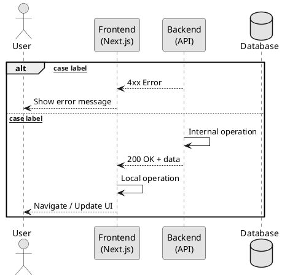

# Prompt: Generate PlantUML Sequence Diagram from Source Code

## Task

Check the source code for the **[FEATURE]** flow in the HanoiGO project and generate PlantUML code to draw a sequence diagram.

## Requirements

- **Language:** English
- **Style:** Monochrome, clean, matches the academic thesis style (see sample below)
- **Content:** Concise but complete — show all key steps, map each step to the actual source file

## PlantUML Style Template

## Output Format

After the PlantUML code block, include a mapping table:

| Step | Source file |
|---|---|
| `POST /some/endpoint` | `path/to/controller.ts` |
| Validate input | `path/to/service.ts` ~line N |
| ... | ... |

## Style Rules

- Solid arrow `->` for requests / actions
- Dashed arrow `-->` for responses / returns
- Self-message `A -> A :` for internal operations (validation, hashing, token generation, etc.)
- Use `alt / else / end` for branching (failure vs success)
- Keep message labels short: `POST /auth/login`, `Verify password (bcrypt)`, `200 OK + token`
- Participants: `User` (actor), `Frontend\n(Next.js)`, `Backend\n(API)`, `Database` (database shape)
