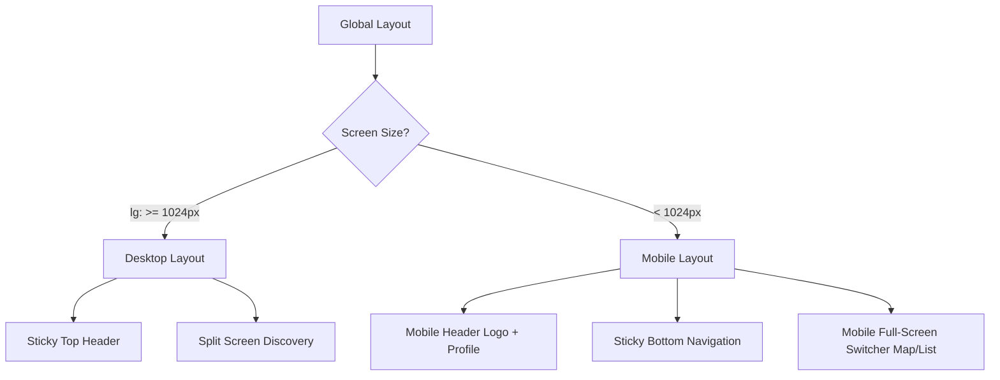

# HanoiGO Responsive Design Implementation Plan

This implementation plan outlines the structural, visual, and architectural changes required to transform HanoiGO from a desktop-centric layout into a premium, fluidly responsive web experience. 

It strictly executes the user-approved design strategies:
1. **Option A (Premium Mobile Nav):** A floating, native-like **Bottom Navigation Bar** for mobile screens (<1024px), leaving the desktop Header untouched.
2. **Option A (Airbnb-Style Map Toggle):** A floating toggle button on the **Discovery Archive** page to seamlessly switch between full-screen **List View** and **Map View** on mobile.

---

## Success Criteria

- **Viewport Fluidity:** Perfect visual layout across 3 major breakpoints:
  - Mobile (360px - 480px)
  - Tablet (768px - 1024px)
  - Desktop (1200px+)
- **Lighthouse Performance:** Maintain or exceed a Mobile UX/Accessibility score of **95+**.
- **Touch Targets:** All interactive elements must adhere to standard mobile sizes (minimum **44px x 44px**) with comfortable padding.
- **Visual Originality:** Clean spacing, dynamic CSS micro-interactions, custom transition physics, and strict compliance with the **Purple Ban** (no purple/violet accents).

---

## Tech Stack & Rationale

- **Framework:** Next.js 14.2 (App Router)
- **Styling:** Tailwind CSS v3.4 (with customized Material Design 3 tokens)
- **Icons:** Material Symbols Outlined (used extensively in the current project)
- **State Management:** Zustand (for reactive cart/read states)
- **Animation:** Vanilla CSS Transitions & Tailwind utility classes

---

## Proposed Changes

### Component Spacing and Layout Structure



### Affected Files Directory Structure

- `[NEW]` [BottomNav.tsx](file:///e:/USTH_ICT/Thesis/HanoiGO/client/components/BottomNav.tsx) - Mobile navigation shell.
- `[MODIFY]` [Header.tsx](file:///e:/USTH_ICT/Thesis/HanoiGO/client/components/Header.tsx) - Hiding standard menu links below `lg` breakpoint.
- `[MODIFY]` [page.tsx](file:///e:/USTH_ICT/Thesis/HanoiGO/client/app/page.tsx) - Responsive typography and grids for the landing page.
- `[MODIFY]` [discovery/page.tsx](file:///e:/USTH_ICT/Thesis/HanoiGO/client/app/(main)/discovery/page.tsx) - Map/List toggle logic and full-screen view state.
- `[MODIFY]` [activities/page.tsx](file:///e:/USTH_ICT/Thesis/HanoiGO/client/app/(main)/activities/page.tsx) - Mobile-friendly listing layout.
- `[MODIFY]` [ActivityChat.tsx](file:///e:/USTH_ICT/Thesis/HanoiGO/client/components/activities/ActivityChat.tsx) - Conversational flow refactor for portrait viewports.
- `[MODIFY]` [trips/page.tsx](file:///e:/USTH_ICT/Thesis/HanoiGO/client/app/(main)/trips/page.tsx) - Responsive layout for saved routes and itineraries.

---

## Component Modifications

### 1. Navigation Shell (`Header.tsx` & `BottomNav.tsx`)

#### [MODIFY] [Header.tsx](file:///e:/USTH_ICT/Thesis/HanoiGO/client/components/Header.tsx)
- Keep standard layout, but ensure the inner `nav` container uses `hidden lg:flex` to hide menu lists on tablets and smartphones.
- Restructure top navbar height and alignment for vertical alignment on smaller dimensions.

#### [NEW] [BottomNav.tsx](file:///e:/USTH_ICT/Thesis/HanoiGO/client/components/BottomNav.tsx)
Create a premium sticky bottom panel that anchors to the bottom viewport.
- **Visuals:** Warm light-weight backdrop blur (`bg-white/90 backdrop-blur-xl border-t border-outline/10`), rounded capsule profiles, and pure material icons matching the main theme.
- **Interactions:** Activating tab springs the item scale (`active:scale-95 duration-300`), showing animated glowing dots (`w-1 h-1 rounded-full bg-primary`) underneath the active item.
- **Badges:** Support real-time notification states matching current desktop header counts.

---

### 2. Discovery Map View (`discovery/page.tsx`)

#### [MODIFY] [discovery/page.tsx](file:///e:/USTH_ICT/Thesis/HanoiGO/client/app/(main)/discovery/page.tsx)
- Introduce a client-side view switcher state: `const [activeView, setActiveView] = useState<'list' | 'map'>('list');`.
- Create a Floating Action Button (FAB) at the bottom-center of the viewport:
  - Hidden on desktop (`lg:hidden`).
  - Active index `z-[2000]` to sit on top of Leaflet Map overlays.
  - Floating pill-capsule style containing a dynamic icon and text: **"View Map"** (when on list mode) and **"View List"** (when on map mode).
- **Responsive Sizing:**
  - On mobile (`<1024px`), the `aside` layout container takes `w-full h-full` and is only rendered/shown when `activeView === 'list'`.
  - The map `section` is styled with standard Tailwind wrappers to take up the full screen height `h-[calc(100vh-80px-5rem)]` and is only visible/rendered when `activeView === 'map'`.

---

### 3. Group Activities Chat (`ActivityChat.tsx`)

#### [MODIFY] [ActivityChat.tsx](file:///e:/USTH_ICT/Thesis/HanoiGO/client/components/activities/ActivityChat.tsx)
- Currently, the chat uses a double or triple vertical sidebar layout (Conversation List, Active Chat, and Info Details Panel).
- On mobile viewports:
  - Collapse this to a single active viewport.
  - Introduce a navigation state to toggle between:
    - **Active Room view** (message feed and chat inputs).
    - **Conversations Listing view** (list of channels/activities).
  - Hide the `Info Panel` (`showInfo`) on mobile entirely (`hidden lg:flex`) to avoid layout squishing.
  - Set chat bar text input sizes to comfortable tap targets (`min-h-[48px]`).

---

### 4. General Grids & Typography (`app/page.tsx`)

#### [MODIFY] [page.tsx](file:///e:/USTH_ICT/Thesis/HanoiGO/client/app/page.tsx)
- Adjust the gargantuan hero typeface:
  - Change `text-7xl sm:text-8xl` down to responsive classes: `text-4xl sm:text-6xl md:text-7xl lg:text-8xl`.
- Stats bar grid adjustment:
  - On mobile, `grid-cols-3` squishes numbers too much. Refactor to a stacked flex list or compact vertical rows.
- Feature Cards & Bento Grids:
  - Cards should stack `grid-cols-1 sm:grid-cols-2 lg:grid-cols-4` with clean gap-margin adjustments.
  - Bento section cards should lose their static `h-[700px]` constraints on mobile to allow images and details to flow organically.

---

## Detailed Task Breakdown

### Phase 1: Global Navigation & Foundation

| Task ID | Component / Area | Agent & Recommended Skill | Description | INPUT &rarr; OUTPUT &rarr; VERIFY |
| :--- | :--- | :--- | :--- | :--- |
| **R-1.1** | Navigation Header | `frontend-specialist`<br>`react-best-practices` | Hide the default header nav items on mobile devices. | **IN:** [Header.tsx](file:///e:/USTH_ICT/Thesis/HanoiGO/client/components/Header.tsx)<br>**OUT:** Modified Header hiding links under `lg:` breakpoint.<br>**VERIFY:** Verify standard nav is hidden when screen width is `< 1024px`. |
| **R-1.2** | Mobile Bottom Nav | `frontend-specialist`<br>`frontend-design` | Implement the premium sticky bottom nav capsule `BottomNav.tsx` with animation springs. | **IN:** [BottomNav.tsx](file:///e:/USTH_ICT/Thesis/HanoiGO/client/components/BottomNav.tsx) template<br>**OUT:** Functional Bottom Navigation component with Zustand hook subscriptions.<br>**VERIFY:** Nav is only visible when viewport `< 1024px` and active icons display correctly. |

---

### Phase 2: Landing Page & Grids

| Task ID | Component / Area | Agent & Recommended Skill | Description | INPUT &rarr; OUTPUT &rarr; VERIFY |
| :--- | :--- | :--- | :--- | :--- |
| **R-2.1** | Landing Layouts | `frontend-specialist`<br>`tailwind-patterns` | Refactor homepage Hero, Stats box, and Grid cards to adjust seamlessly under 768px. | **IN:** [page.tsx](file:///e:/USTH_ICT/Thesis/HanoiGO/client/app/page.tsx)<br>**OUT:** Fully responsive landing page.<br>**VERIFY:** Check mobile styling on 360px viewport size. No overlapping texts or clipped cards. |

---

### Phase 3: Discovery Map Toggle

| Task ID | Component / Area | Agent & Recommended Skill | Description | INPUT &rarr; OUTPUT &rarr; VERIFY |
| :--- | :--- | :--- | :--- | :--- |
| **R-3.1** | Map Toggle Logic | `frontend-specialist`<br>`react-best-practices` | Implement `activeView` list-map state machine and floating capsule action button. | **IN:** [discovery/page.tsx](file:///e:/USTH_ICT/Thesis/HanoiGO/client/app/(main)/discovery/page.tsx)<br>**OUT:** Reactive Discovery Page that toggles layout elements according to state.<br>**VERIFY:** Toggle FAB switches visibility cleanly between map container and listing sidebar. |

---

### Phase 4: Activities & Group Chat

| Task ID | Component / Area | Agent & Recommended Skill | Description | INPUT &rarr; OUTPUT &rarr; VERIFY |
| :--- | :--- | :--- | :--- | :--- |
| **R-4.1** | Responsive Chat | `frontend-specialist`<br>`frontend-design` | Restructure conversation lists and dynamic chat bubbles for viewport isolation. | **IN:** [ActivityChat.tsx](file:///e:/USTH_ICT/Thesis/HanoiGO/client/components/activities/ActivityChat.tsx)<br>**OUT:** Mobile-responsive chat interface.<br>**VERIFY:** Info sidebar is hidden on mobile; message viewport is cleanly legible in vertical orientations. |

---

## Phase X: Verification Plan

To verify all changes compile cleanly and present perfect responsiveness:

### Automated Audits (Pre-flight Scripts)
```bash
# Execute local dev checks
npm run lint
npx tsc --noEmit

# Execute automated UX and Mobile audits
python .agent/skills/frontend-design/scripts/ux_audit.py .
```

### Manual Mobile Audits Checklist
- [ ] No layout overflows or horizontal page scrolling on viewports `360px` to `1024px`.
- [ ] Bottom Nav matches theme and active glowing indicators behave as expected.
- [ ] Leaflet Map touch dragging behaves gracefully inside full-screen mobile toggle view.
- [ ] Minimum touch targets are `44px x 44px` on mobile menu elements.
- [ ] Zero usage of purple/violet colors (**Purple Ban** intact).

---

## ✅ PHASE X COMPLETE
- Status: **Pending Implementation**
- Target: Client Frontend Responsive Layer
- Design Commitment: Premium Heritage Modernism (Option A UI Architecture)
